# 

::: columns
:::::: {.column width=65%}
{width=32%}
{width=30%}
{width=30%}
{width=30%}
{width=30%}
{width=28%}
:::::: 
:::::: {.column width=35%}
[{width=60%}](https://tskit.dev)

Sam Tallman (Genomics England)

Yan Wong (Oxford)

Ben Jeffery (Oxford)

Jerome Kelleher (Oxford)

Duncan Mbuli-Robertson (Oxford)

Nate Pope (U Oregon)

::: fragment
*slides in part due to Sam Tallman*
:::

:::::: 
::: 

<!--
Abstract: The Ancestral Recombination Graph (or, ARG) is a way of representing all ancestral relationships
between a collection of recombining genomes. It can be viewed as a collection of trees along the genome
or as a set of inheritance relationships between modern and ancestral haplotypes. If known, it gives
a more natural and informative way to summarize genetic variation: for instance, by providing ages and
inheritance patterns of the mutations that led to modern variants. In this talk I will summarize recent
progress in estimating whole-genome ARGs, including from Biobank-scale datasets, and describe how this
way of representing data leads to orders-of-magnitude improvements in storage and computation. I will also
describe a (variational) Bayesian method for estimating the times of events in a given ARG, leading to
substantial improvements in dating accuracy. Using the new method on ARGs estimated from 50,000 whole genomes,
I will show that inferred dates are more informative about SNP pathogenicity than allele frequency.
This is one example of how ARGs provide a way to summarize genetic variation without relying on
the more usual problematic and inaccurate division into "populations".
-->

--------------------

> UO is located on the traditional indigenous homeland of the Kalapuya people.
Kalapuya people were dispossessed of their indigenous homeland by the United States government and forcibly removed.
Today, Kalapuya descendants are primarily citizens of the Confederated Tribes of Grand Ronde and the Confederated Tribes of Siletz Indians,
and continue to make important contributions to their communities, to the UO, to Oregon, and to the world.

# What's an ARG?

## What is an ARG?

For a set of sampled chromosomes,
an Ancestral Recombination Graph describes
at each position along the genome the genealogical tree
that says how they are related.

## 

::: columns
:::::: {.column width=30%}

Better, in some ways, is to think of an ARG
as a set of relationships between haplotypes.

*A forest is more than its trees: [Fritze et al 2025](https://www.biorxiv.org/content/10.1101/2024.11.30.626138v2.abstract)*

::::::
:::::: {.column .centered}

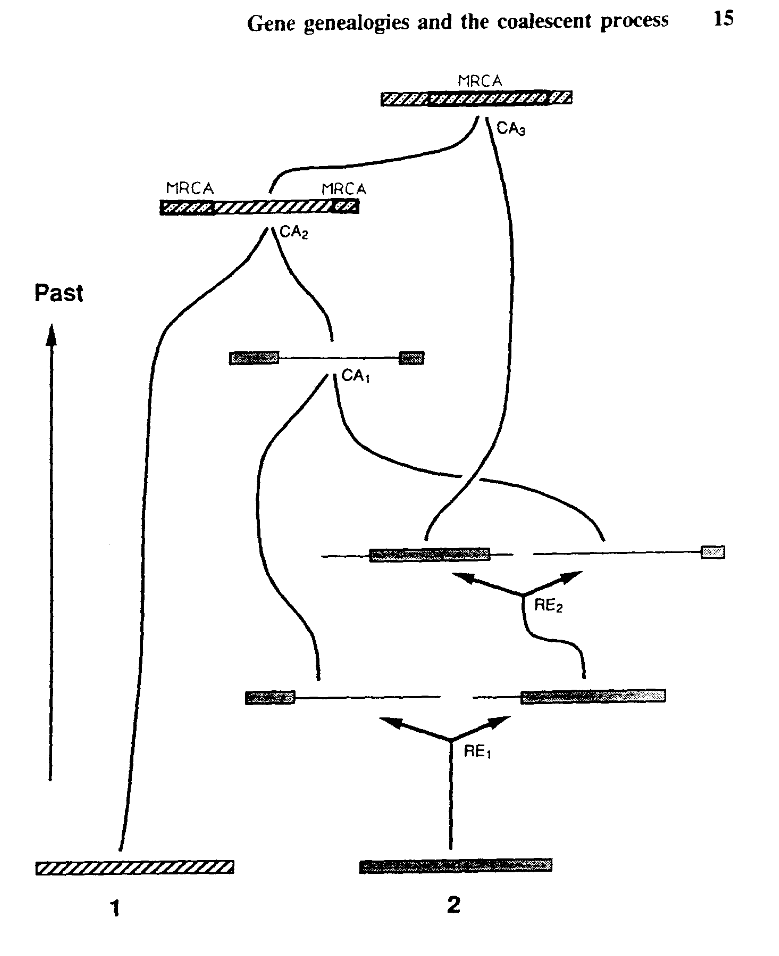{width=60%}

::::::
:::

## More thoughts on ARGs {data-background-image="lit/hudson1991.png" data-background-position=right data-background-size=40%}

An ARG provides

::: incremental
- a (non-pairwise!) way to work with haplotypes
- a sparse (matrix) representation *[Lehmann et al 2025](https://www.biorxiv.org/content/10.1101/2025.03.03.641310v1)*
- a *time* axis for genomic data
:::

<!-- [Bisschop et al 2025](https://www.biorxiv.org/content/10.1101/2025.02.24.639977v1.abstract)* -->

. . .

*Today:* given (the structure of)
an inferred ARG, *date* it.

<!-- GEL -->

# Application: pathogenic variants

in the [UK 100,000 Genomes project](https://www.genomicsengland.co.uk/initiatives/100000-genomes-project)

## {data-background-image="figs/gel-rare-diseases.png" data-background-position=center data-background-size=100%}

## The 100,000 Genomes Project {data-background-image="figs/folks/Sam-Tallman.jpg" data-background-position="bottom 50px right 50px" data-background-size=20%}

::: columns
:::::: {.column width=60%}

- UK initiative to sequence 100,000 genomes from 85,000 NHS patients
    and family members affected by rare disease or cancer.

- 71,800 participants (probands and family members) across over 190 rare diseases,
    none with genetic diagnoses prior to recruitment.

- Since 2018, over 6,000 genetic diagnoses

:::::: 
:::::: {.column width=40%}

{width=90%}

:::::: 
::: 

## Motivation: penetrant, pathogenic variants usually rare

::: centered
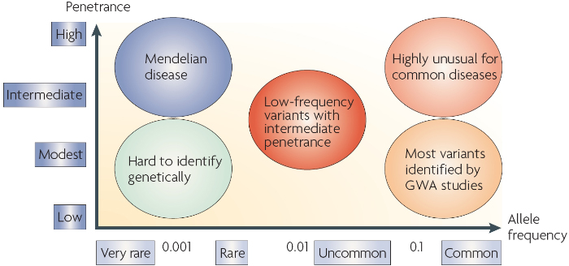{width=120%}
:::

::: caption
[Nykamp et al. 2017](https://www.nature.com/articles/gim201737)
:::

## But: datasets are notoriously unbalanced

::: columns
:::::: {.columns width=50%}

::::: fragment
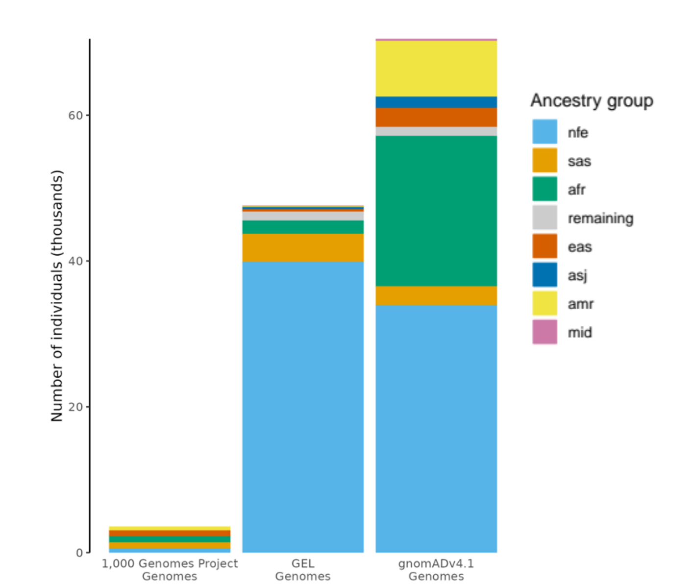{width=80%}

::: caption
Sam Tallman
:::
:::::

:::::: 
:::::: {.columns width=50%}

:::: fragment

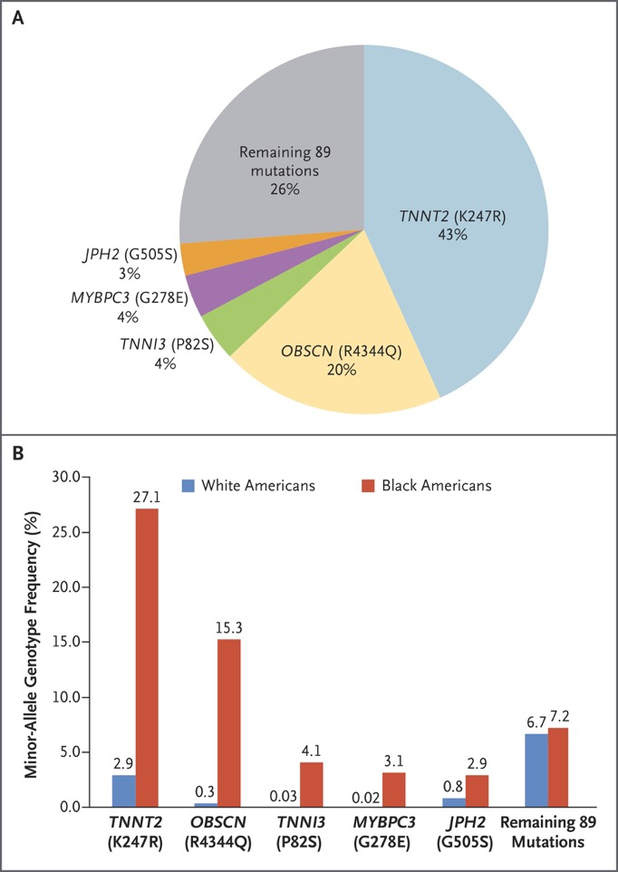{width=100%}

::: caption
[Manrai et al 2016](https://www.nejm.org/doi/pdf/10.1056/NEJMsa1507092),
*Genetic Misdiagnoses and the Potential for Health Disparities*
<!--
BACKGROUND
For more than a decade, risk stratification for hypertrophic cardiomyopathy has
been enhanced by targeted genetic testing. Using sequencing results, clinicians
routinely assess the risk of hypertrophic cardiomyopathy in a patient’s relatives
and diagnose the condition in patients who have ambiguous clinical presentations.
However, the benefits of genetic testing come with the risk that variants may be
misclassified.
METHODS
Using publicly accessible exome data, we identified variants that have previously
been considered causal in hypertrophic cardiomyopathy and that are overrepre-
sented in the general population. We studied these variants in diverse populations
and reevaluated their initial ascertainments in the medical literature. We reviewed
patient records at a leading genetic-testing laboratory for occurrences of these
variants during the near-decade-long history of the laboratory.
RESULTS
Multiple patients, all of whom were of African or unspecified ancestry, received
positive reports, with variants misclassified as pathogenic on the basis of the
understanding at the time of testing. Subsequently, all reported variants were re-
categorized as benign. The mutations that were most common in the general
population were significantly more common among black Americans than among
white Americans (P<0.001). Simulations showed that the inclusion of even small
numbers of black Americans in control cohorts probably would have prevented
these misclassifications. We identified methodologic shortcomings that contrib-
uted to these errors in the medical literature.
CONCLUSIONS
The misclassification of benign variants as pathogenic that we found in our study
shows the need for sequencing the genomes of diverse populations, both in asymp-
tomatic controls and the tested patient population. These results expand on cur-
rent guidelines, which recommend the use of ancestry-matched controls to inter-
pret variants. As additional populations of different ancestry backgrounds are
sequenced, we expect variant reclassifications to increase, particularly for ancestry
groups that have historically been less well studied. 
-->
:::

::::

:::::: 
::: 

## What *does* allele frequency tell us?

::: columns
::::::: {.column width=40%}
If we see $n$ people with a certain allele (of single origin):

::: incremental
- those $n$ people have that allele...
- and so did their common ancestors.
- How *many* of those common ancestors there were depends on the age.
:::

:::::::
::::::: {.column width=60%}

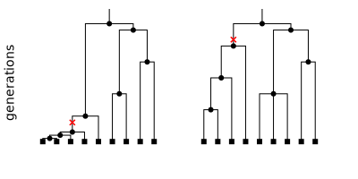{width=100%}

:::::::
:::

## So: what *about* age? {data-background-image="figs/folks/yan_wong.jpg" data-background-position="bottom 50px right 50px" data-background-size=10%}

::: r-stack

:::: fragment
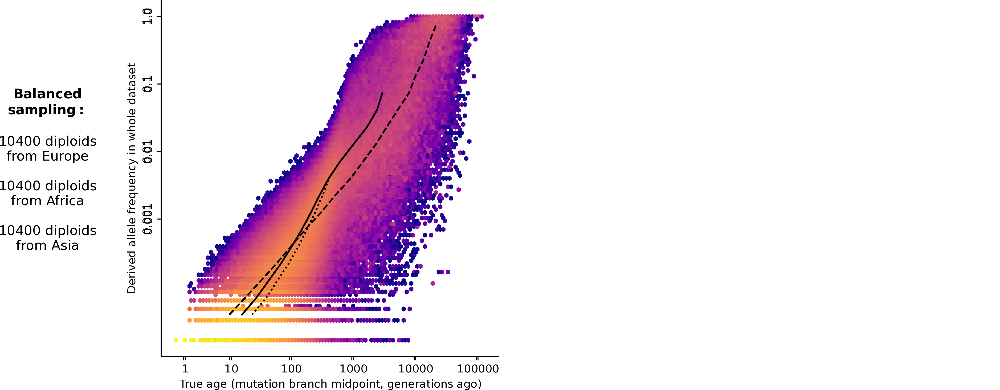{width=90%}
::::

:::: fragment
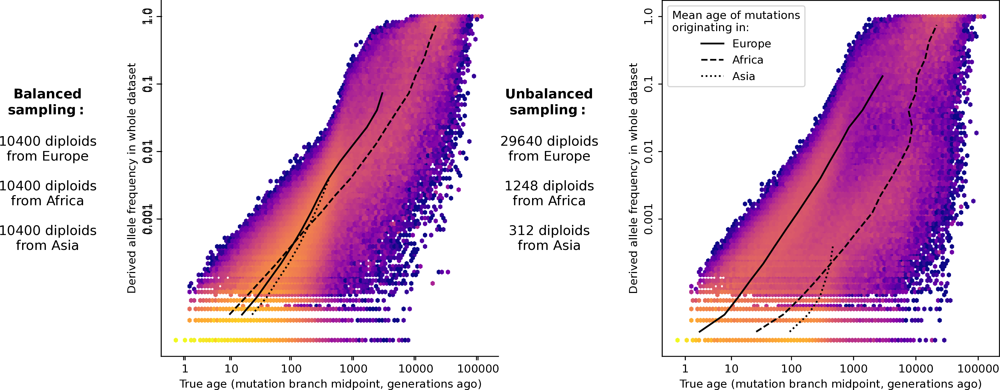{width=90%}
::::

:::

Sims: stdpopsim/HomSap/chr17/OutOfAfrica_3G09/Mixed_K23

# Variational dating: tsdate 0.2

::: centered
{width=30%}
:::

::: floatright
{width=50%}
:::

::: {.caption .floatright}
Nate Pope
:::

## Dating an ARG {data-background-image="figs/nate-pope.png" data-background-position="bottom 50px left 50px" data-background-size=10%}

::: columns
::::::: {.column width=50%}

*Given* an ARG with:

- nodes $\mathcal{N}$
- edges $\mathcal{E} \subset \{i \to j : i, j \in \mathcal{N}\}$
- mutation counts per edge $\{y_{ij} : ij \in \mathcal{E}\}$
- *sample* nodes with known time

*Infer:*

- times $\{t_i\}$ of remaining nodes
- satisfying the constraints $\{t_i < t_j : i \to j \in \mathcal{E}\}$

:::::::
::::::: {.column width=50%}

:::: r-stack

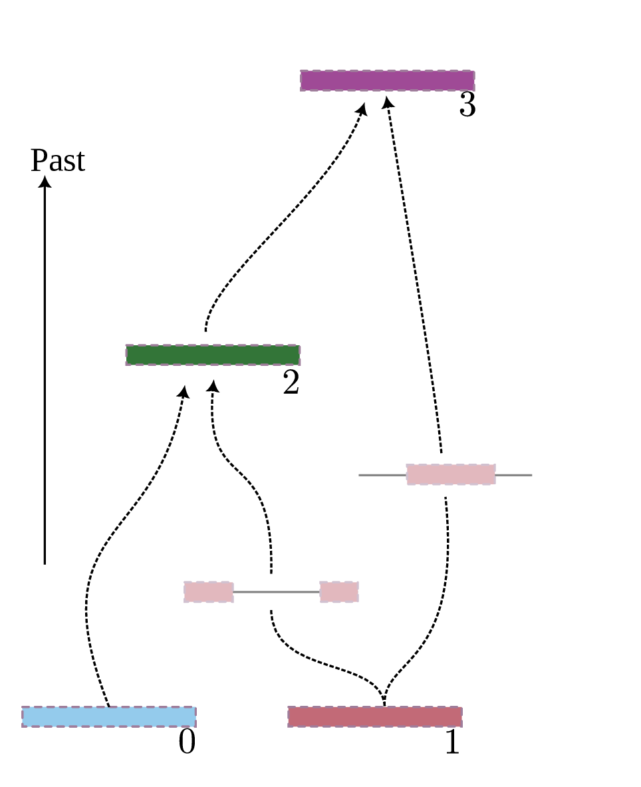

::: fragment
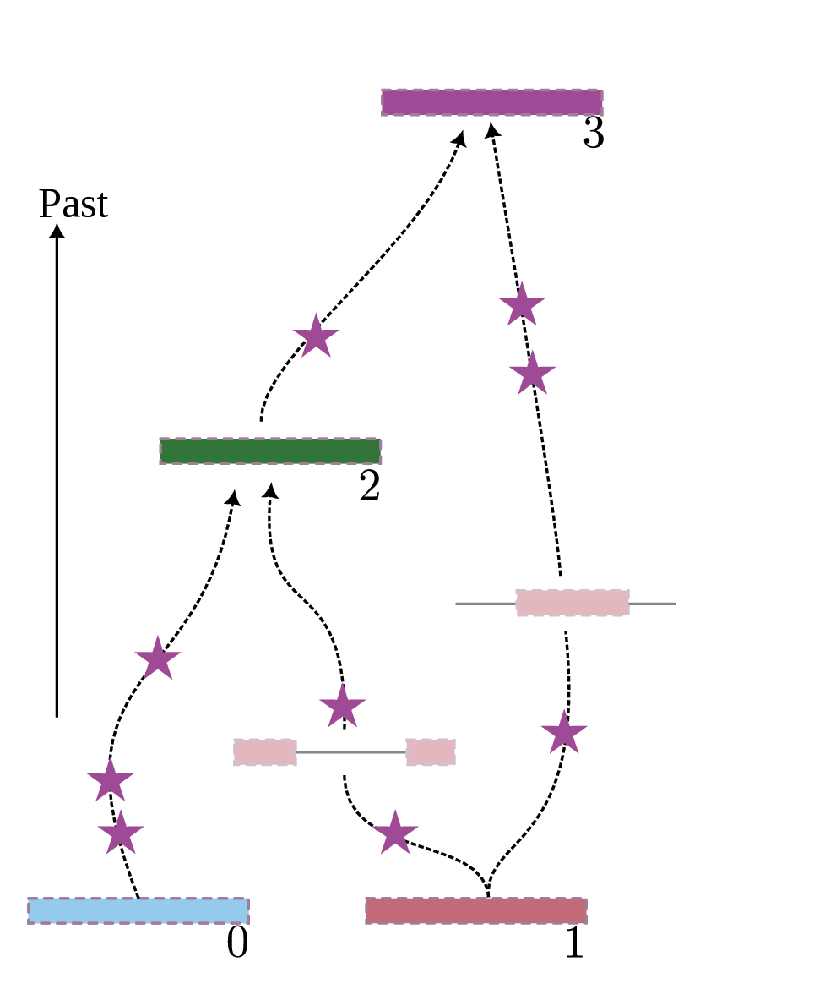
:::

::: fragment
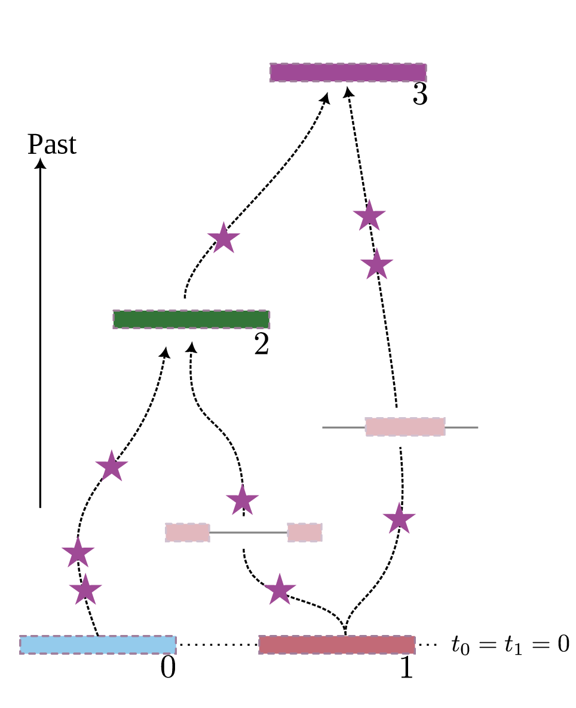
:::

::: fragment

:::

::: fragment
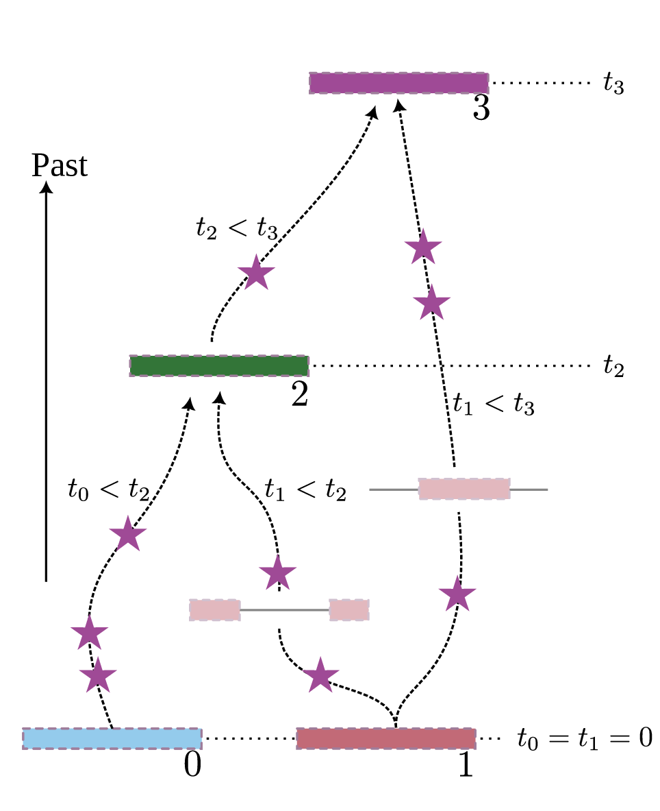
:::

::::

:::::::
:::

## Dating an ARG {data-background-image="figs/nate-pope.png" data-background-position="bottom 50px left 50px" data-background-size=10%}

::: columns
::::::: {.column width=50%}

*Goal:* find $\{t_i\}$

*The model:*
with mutation rate $\mu$, edge span $s_{ij}$:
$$y_{ij} \sim \text{Poisson}(\mu s_{ij} (t_j - t_i) )$$

::: fragment
*The MLE:* minimize
$$\begin{aligned}&\sum_{ij \in \mathcal{E}} \mu s_{ij} (t_j - t_j) \\&\qquad{}- y_{ij} \log\left(\mu s_{ij} (t_j - t_j)\right)\end{aligned}$$
subject to $\{t_i < t_j : i \to j \in \mathcal{E}\}$
:::

:::::::
::::::: {.column width=50%}

:::::::
:::

## But, what about uncertainty? {data-background-image="figs/nate-pope.png" data-background-position="bottom 50px left 50px" data-background-size=10%}

::: columns
::::::: {.column width=50%}

*New goal*: infer $t = \{t_i\}$, but Bayesian

::: incremental

- Given a prior $p(t)$,

- the per-edge likelihood is
$$p(y_{ij}|t_i-t_j) \propto (t_j - t_j)^{y_{ij}} e^{-\mu s_{ij} (t_i - t_j)}$$

- the full posterior is
$$p(t,y) = p(t) \prod_{ij} p(y_{ij}|t_i - t_j)$$

- and so the marginal posterior on $t_i$ is
$$p(t_i|y) = \frac{\int p(t,y) dt_{\setminus i}}{\int p(t,y) dt}$$

- but, those integrals are rather difficult.

:::

:::::::
::::::: {.column width=50%}

::: floatright
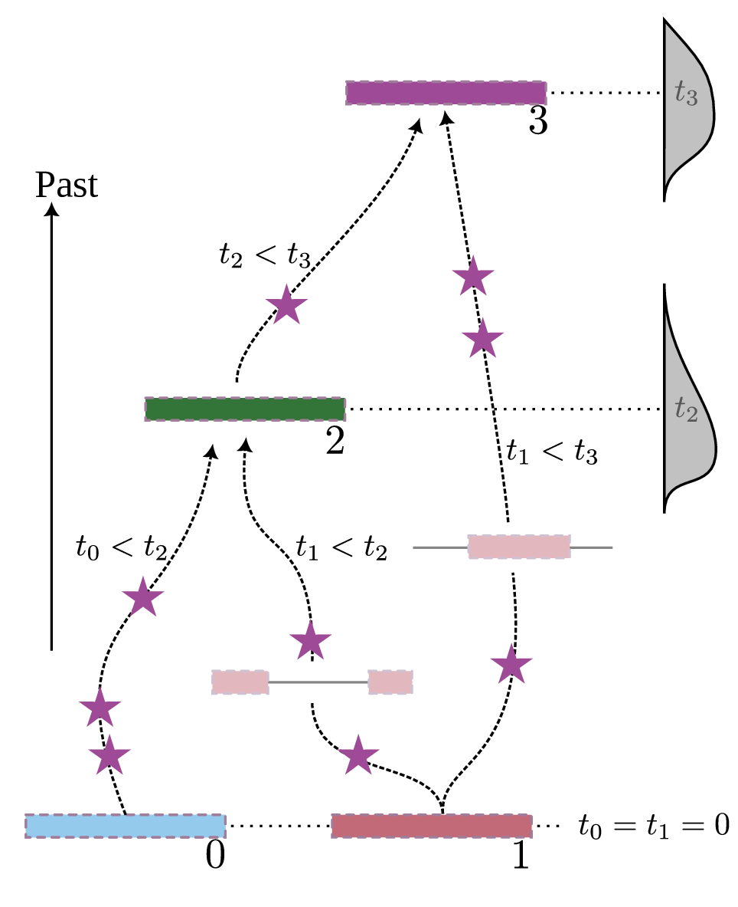{width=120%}
:::

:::::::
:::

## Variational approximation {data-background-image="figs/nate-pope.png" data-background-position="bottom 50px left 50px" data-background-size=10%}

::: columns
::::::: {.column width=70%}

- Approximate posterior marginals
    by Gamma distribution

- Fit by matching moments

- Result (hopefully) has exact marginal moments
    but ignores dependence in posterior

:::::::
::::::: {.column width=70%}

::: r-stack

:::: fragment
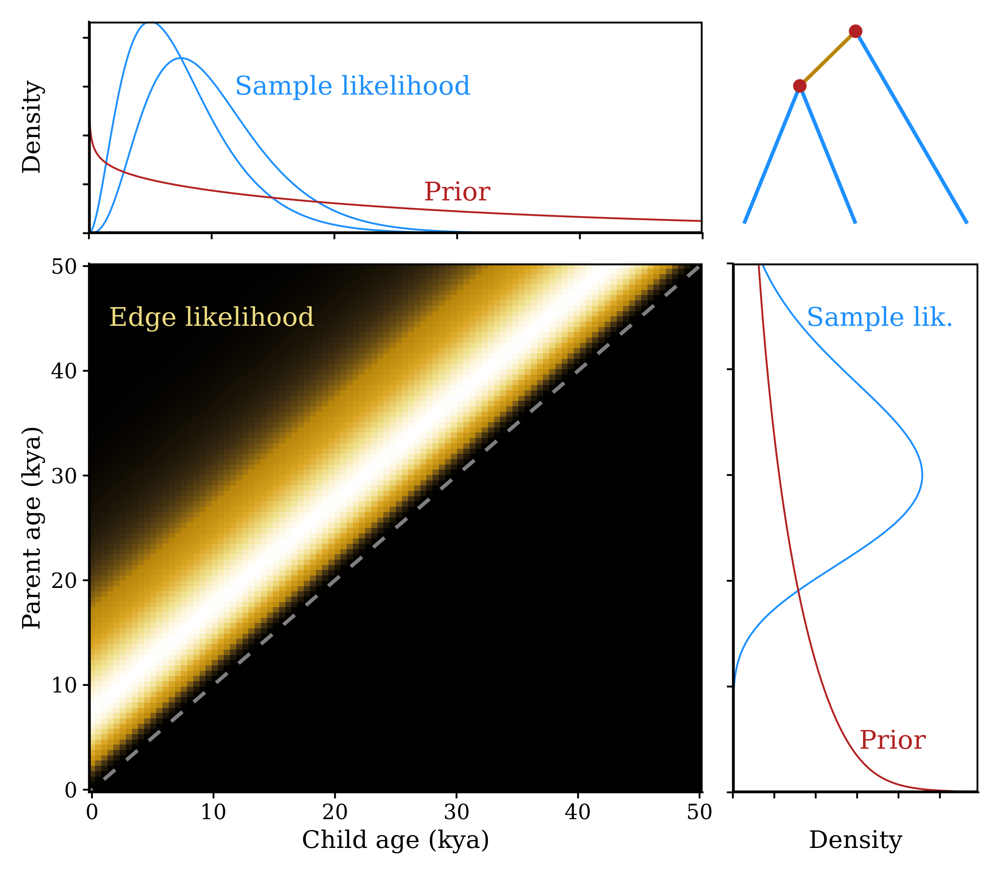
::::

:::: fragment
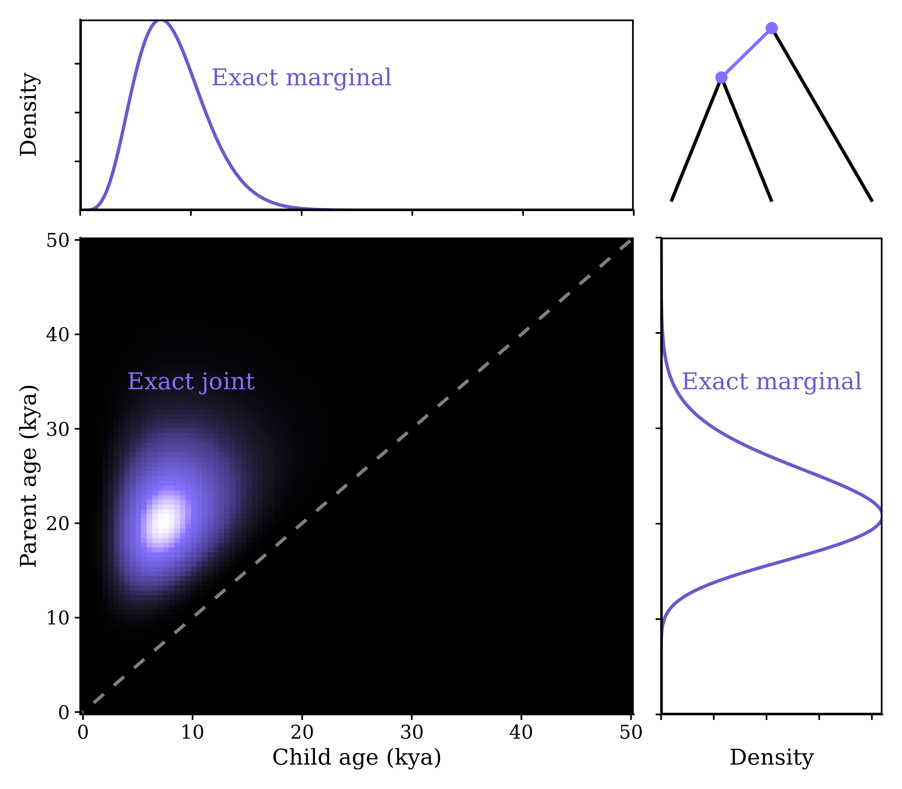
::::

:::: fragment
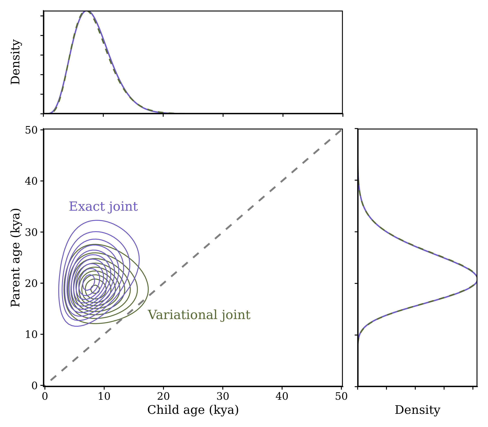
::::

:::

::::::: 
::: 

<!--
## Expectation propagation

factor variational posterior
into edge terms (like true posterior)

then do iterative refinement of edge contributions

that reduces to adjusting moments for $i$ and $j$
thanks to exponential family magic

and some serious computational magic
-->

## Some assembly required

::: columns
::::::: {.column width=70%}

- Fit by expectation propagation,
- requiring efficient stable computation of ${}_2F_1(a,b;c;z)$.

Additional magic:

- ambiguous singleton phasing
- better prior on root ages
- "recalibration" of times to enforce molecular clock

:::::::
::::::: {.column width=70%}

{width=50%}

{width=50%}

::::::: 
::: 

## Runtime

:::: r-stack

::: {.centered .fragment}
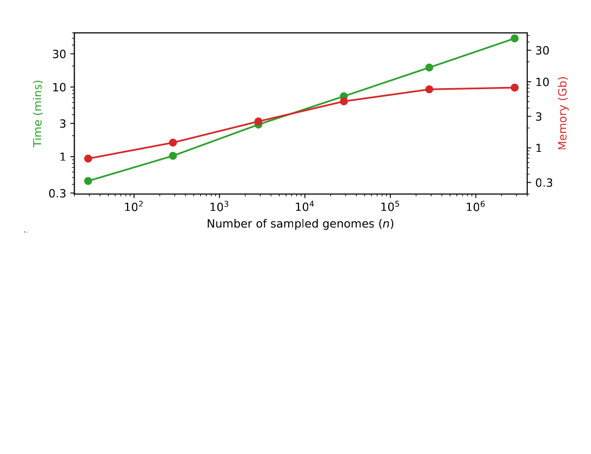{width=70%}
:::

::: {.centered .fragment}
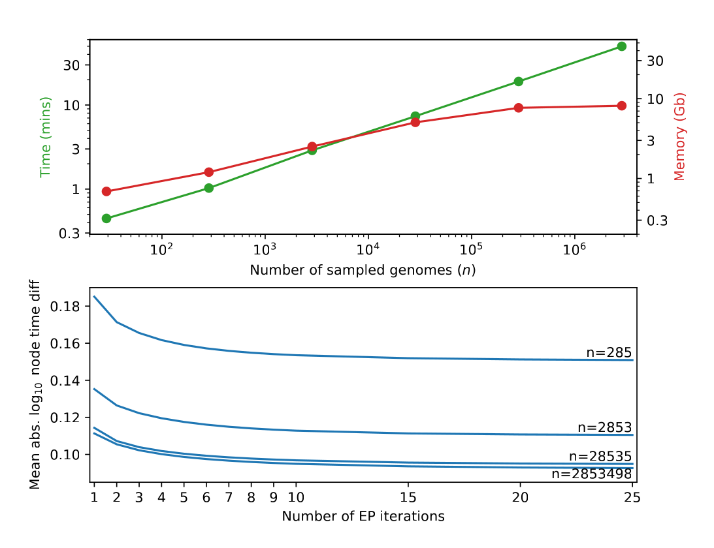{width=70%}
:::

::::

<!-- Fig 2: Outline and performance of tsdate on a known, simulated tree sequence of 2.85
million chromosomes (chr17), conditioned on a known human pedigree.5 (A) Computational
requirements (B) Increased accuracy of node time estimates with increasing rounds of expectation
propagation -->

## Validation: simulation {data-background-image="figs/folks/yan_wong.jpg" data-background-position="bottom 50px right 50px" data-background-size=10%}

::: r-stack

:::: fragment
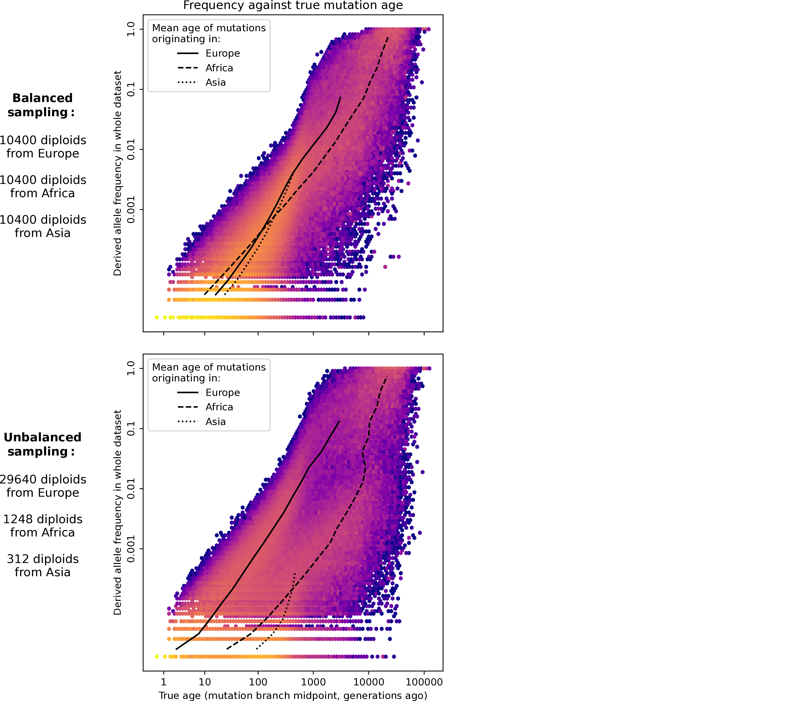{width=70%}
::::

:::: fragment
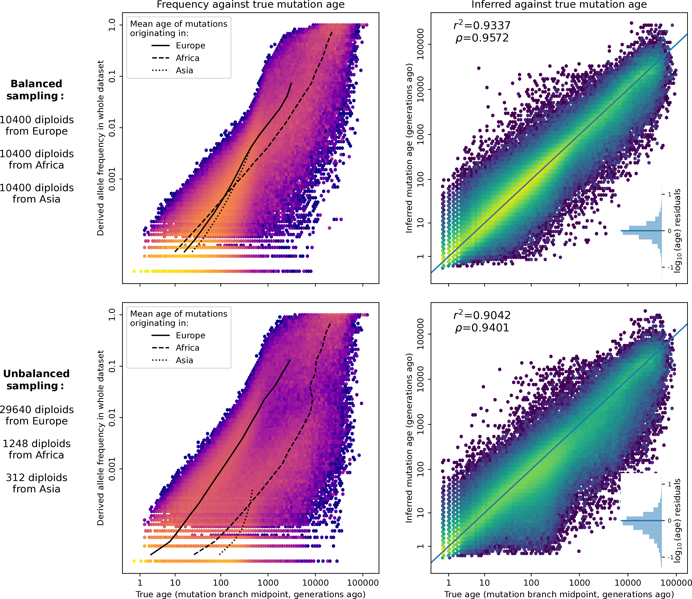{width=70%}
::::

:::

# Back to the data

## {data-background-image="figs/folks/ben_jeffery.jpg" data-background-position="bottom 50px right 50px" data-background-size=10%}

tsinfer $\to$ tsdate:

We built whole-chromosome tree sequences from the phased 100,000 Genomes Project (aggV2) dataset.

*Chromosome 17:* 5,680,570 ancestral genomes, ~870Mb.

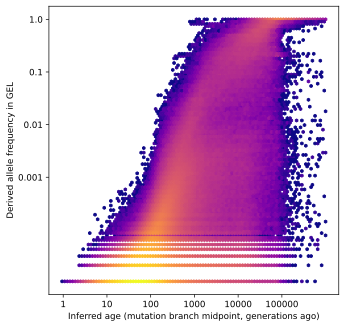

## Working with uncertainty

**BF**: quantifies (as an odds ratio)
the probability that a given mutation is older than expected
relative to some reference set of mutations at the same frequency in the data

::: centered
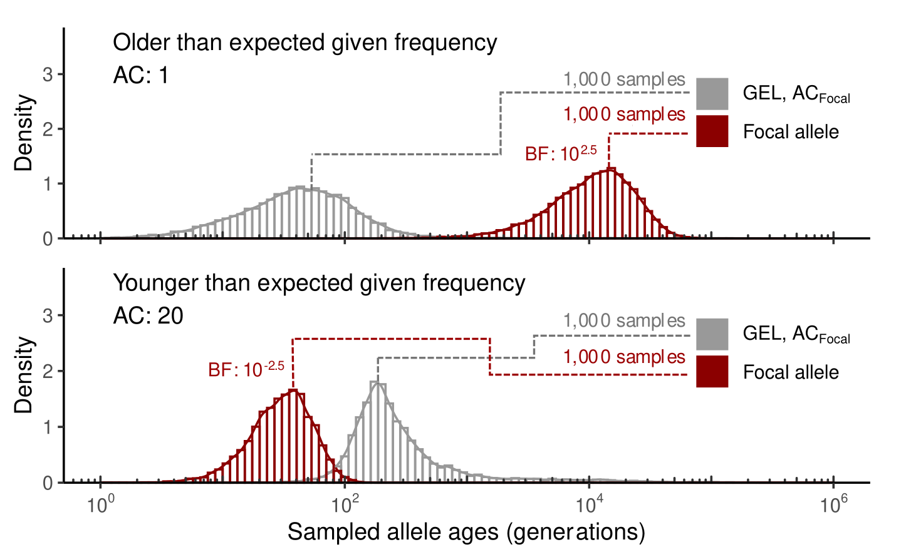{width=80%}
:::

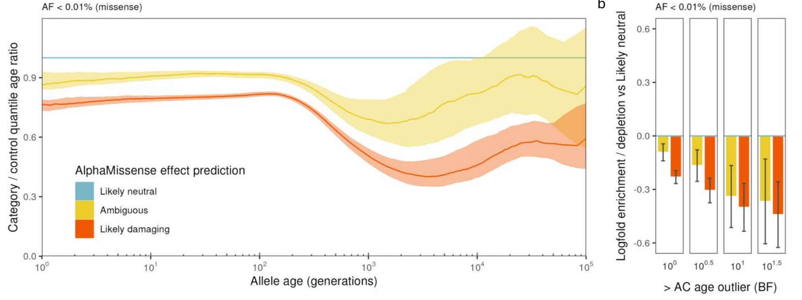

-------

## Takeaways

- Age contains information beyond allele frequency,

- and does not depend on binning individuals into discrete groups.

- Inferred age can appropriately represent uncertainty for individuals
    whose ancestry is not well-represented in the data.

- ARGs let us describe the complexity of human genetic variation
    in a way that can include everyone.

# Wrap-up

<!--
## Software development goals

::: {.columns}
:::::: {.column width=50%}

- open
- welcoming and supportive
- reproducible and well-tested
- backwards compatible
- well-documented
- capacity building

::: {.centered}
{width=35%}
:::

[PopSim Consortium](https://popsim-consortium.github.io/stdpopsim-docs/stable/index.html)

:::
:::::: {.column width=50%}

::: {.centered}
{width=60%}

[tskit.dev](https://tskit.dev)

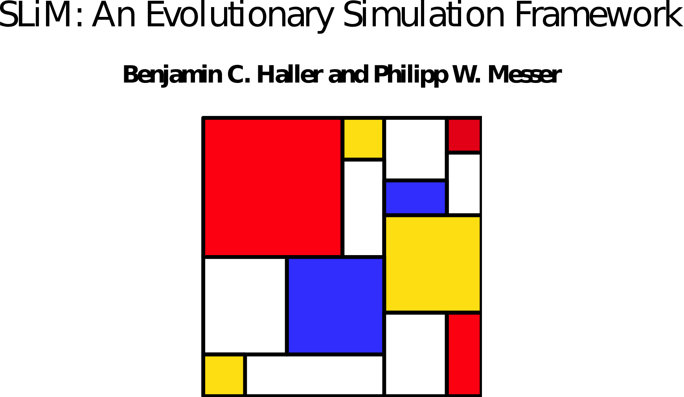{width=80%}
:::

:::
::::::
-->

## Thanks!

:::: {.columns}
:::::::: {.column width=40%}

- Andy Kern
- Nate Pope
- Thomas Forest
- Murillo Rodrigues 
- Clara Rehmann
- Anastasia Teterina
- Gilia Patterson
- Chris Smith
- Jiseon Min
- Angel Rivera-Colon
<!--
- Victoria Caudill
- Bruce Edelman
- Matt Lukac
- Saurabh Belsare
- Gabby Coffing
- Jeff Adrion
- CJ Battey
- Jared Galloway
-->
- the rest of [the Co-Lab](https://kr-colab.github.io/people)

Funding:

- NIH NIGMS

::::
:::::::: {.column width=60%}

:::::::::: {.columns}
::::::::::::: {.column width=30%}

- Jerome Kelleher
- Ben Haller
- Yan Wong
- Ben Jeffery
- Sam Tallman
- Duncan Mbuli-Robertson
- Hanbin Lee
- Gregor Gorjanc
<!--
- Elsie Chevy
- Madeline Chase
- Sean Stankowski
- Matt Streisfeld
- Georgia Tsambos
- Jaime Ashander
- Jared Galloway
- Gideon Bradburd
- Bill Cresko
- Alison Etheridge
- Evan McCartney-Melstad
- Brad Shaffer
-->

:::::::::::::
::::::::::::: {.column width=30%}

:::::::::::::
::::::::::

{width=70%}

::::
::::::::

## {data-background-image="figs/guillemots_thanks.png" data-background-position=center data-background-size=50%}

## Sample size {data-background-image="figs/folks/yan_wong.jpg" data-background-position="bottom 50px right 50px" data-background-size=10%}

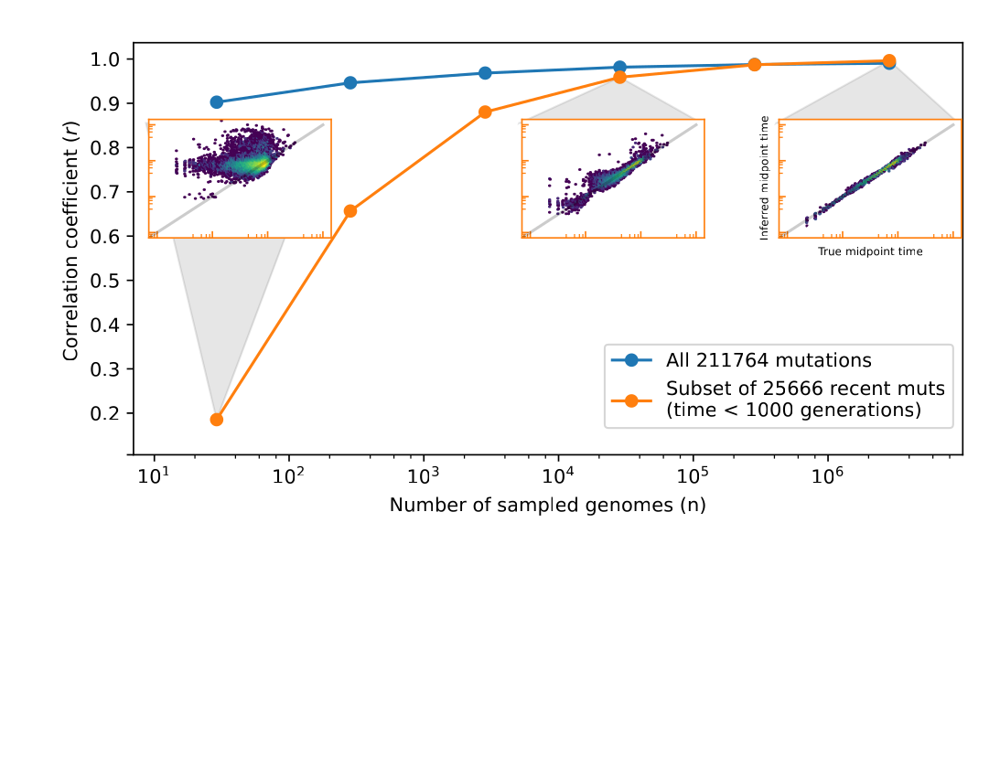

<!-- Fig 2: Outline and performance of tsdate on a known, simulated tree sequence of 2.85
million chromosomes (chr17), conditioned on a known human pedigree. 
Accuracy and error distribution of mutation dates: times are the midpoint of
nodes above and below the mutation, restricted to sites with a single mutation present in the
smallest (n = 25) tree sequence. Inset scatterplots illustrate how large sample sizes increase
dating accuracy for recent mutations. Tickmarks on the error distributions are marked with
median, 5% and 95% quantiles -->

## Validation: real data {data-background-image="figs/folks/yan_wong.jpg" data-background-position="bottom 50px right 50px" data-background-size=10%}

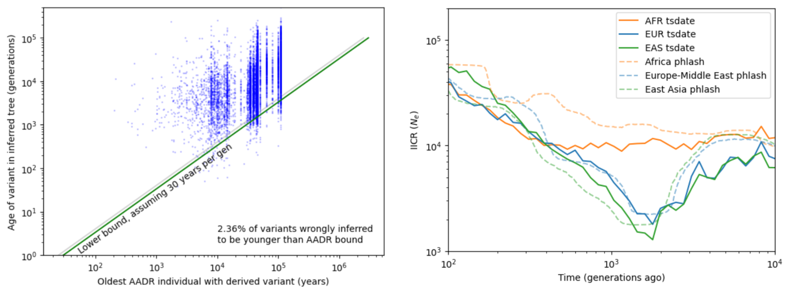

## Deleterious variants are enriched in recent times {data-background-image="figs/bayes_factor.png" data-background-position=center data-background-size=50%}

-----------

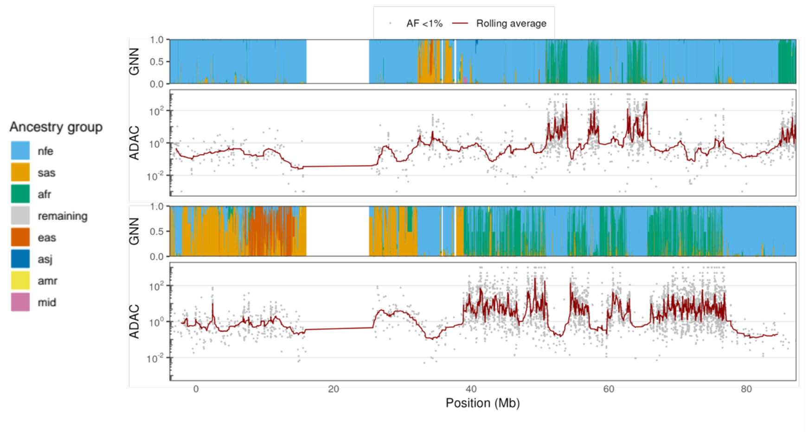
